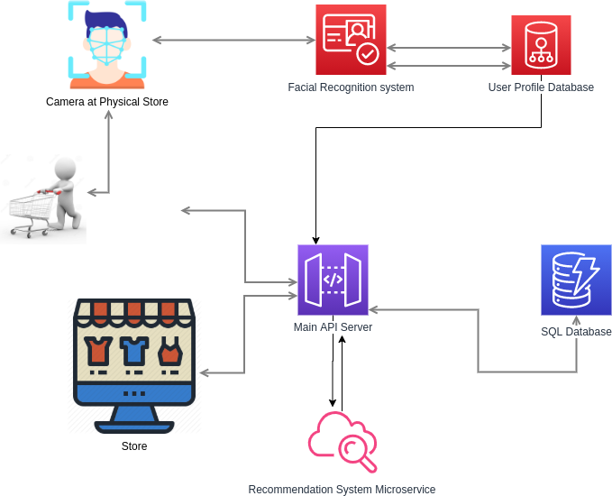
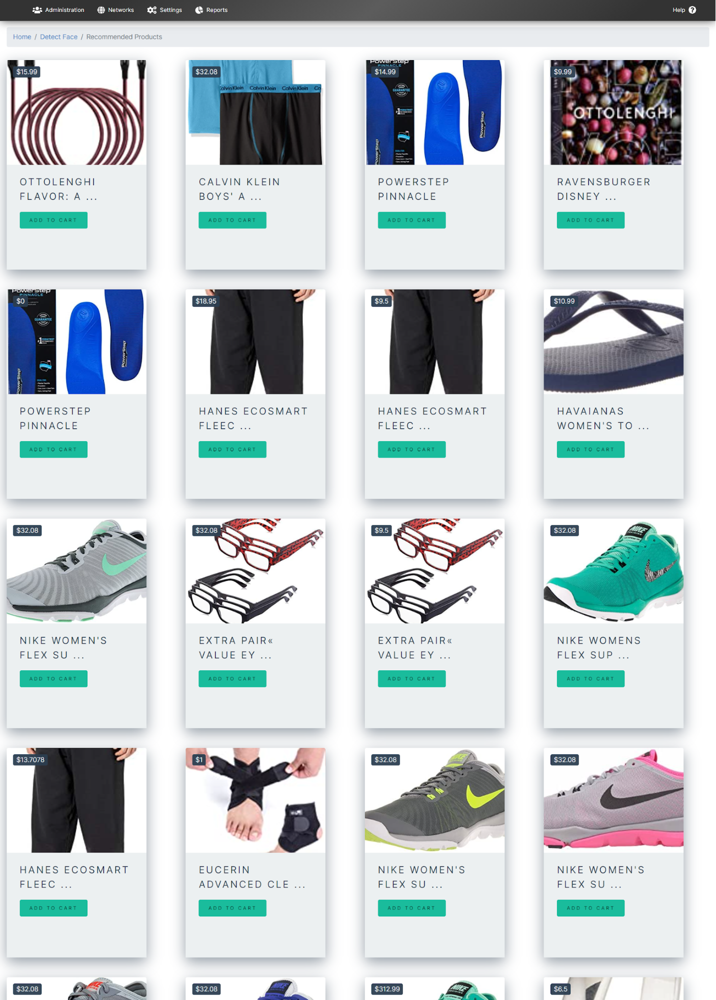
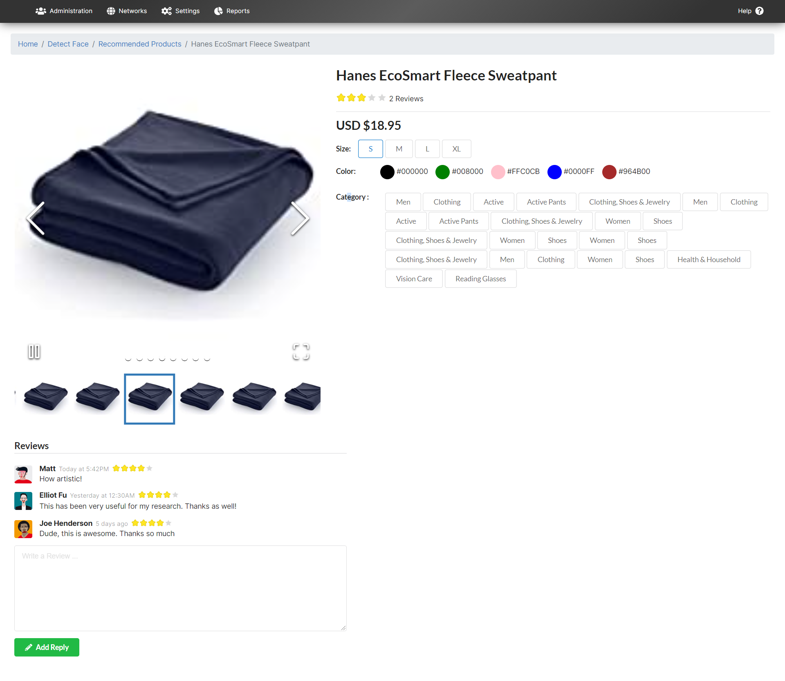
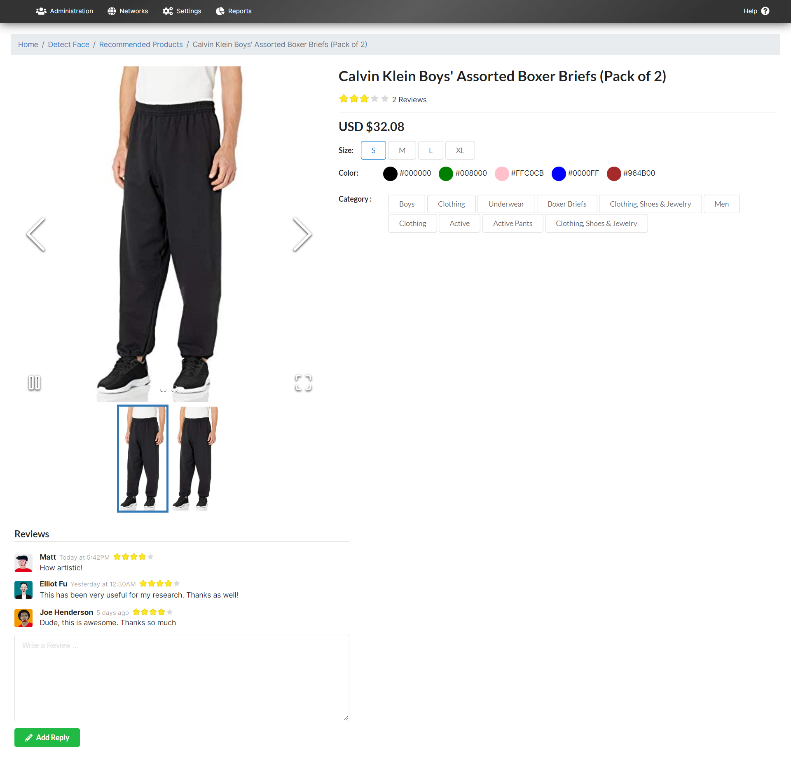

# Recognize and Recommend

A cutting-edge AI application designed for integration with superstores and outlets to recognize customers through facial recognition and recommend relevant products based on their interests and purchase history.

## Table of Contents

- [Introduction](#introduction)
- [Methodology](#methodology)
  - [Recognition](#recognition)
  - [Recommendation](#recommendation)
- [Development Phases](#development-phases)
  - [Data Collection](#data-collection)
  - [Data Cleaning and Categorization](#data-cleaning-and-categorization)
  - [Face Detection and Recognition](#face-detection-and-recognition)
  - [Product Recommendation](#product-recommendation)
- [Getting Started](#getting-started)
  - [Prerequisites](#prerequisites)
  - [Installation](#installation)
  
- [Machine Learning and Deep Learning Models](#machine-learning-and-deep-learning-models)
- [Acknowledgements](#acknowledgements)

## Introduction

Recognize and Recommend is an innovative AI application that enhances the shopping experience by seamlessly integrating with superstores and outlets. Using state-of-the-art facial recognition technology, the application identifies customers upon arrival and recommends products tailored to their interests. Built using Django for the backend and React.js for the frontend, Recognize and Recommend employs a facial recognition system and collaborative filtering recommendation system to deliver personalized shopping experiences.

## Methodology

### Recognition

The application uses a high-quality camera to detect users' faces, which are then sent to the backend. The backend features an efficient image detector and recognizer that detects and encodes facial features, saving them to a database with a name or system-generated label.

### Recommendation

Once a user has been successfully identified, the system checks their purchase history and product ratings. Using collaborative filtering, the application recommends products that have been highly rated by other users with similar interests.

## Development Phases

### Data Collection

The primary data source is the Amazon Product reviews dataset, which provides extensive information about products, customer ratings, and purchase history.

### Data Cleaning and Categorization

Two primary data points are used:
- Presenting recommended products to customers
- Training the model to generate recommendations

The raw data is cleaned and categorized accordingly, with only product IDs, customer IDs, and customer ratings used for the recommendation system.

### Face Detection and Recognition

A face detection API on the frontend detects faces from video and sends them to the backend, which deploys separate modules for face recognition, such as Haar cascade, LBPH, and the face recognition API.

### Product Recommendation

Collaborative filtering is used to recommend products to users based on their purchase history and ratings from other customers with similar interests.

## Machine Learning and Deep Learning Models

- **SSD Mobilenet V1**: A Single-Shot Multibox Detection (SSD) network implemented using the Caffe* framework, used on the frontend to detect faces from the camera video.
- **Haar cascade**: A machine learning-based approach for object detection, used on the backend to generate features after receiving the image from the frontend.
- **LBPH**: Local Binary Pattern (LBP) is an efficient texture operator that labels image pixels by thresholding the neighborhood of each pixel, considering the result as a binary number.
- **Collaborative Filtering Recommendation**: A recommendation model that filters or evaluates items based on the opinions of other users, helping to recommend products to customers.

## Getting Started

### Prerequisites
  - Python 3.6+
  - Node.js
  - NPM or Yarn

### Installation
  1. Clone the frontend repository:
     
     git clone https://github.com/hassan11196/RecognizeAndRecommend.git`

  2. Clone the backend repository:
  
    git clone https://github.com/hassan11196/RecognizeAndRecommend-Backend.git

  3. Install Python dependencies for the backend:
    
    cd RecognizeAndRecommend-Backend
    pip install -r requirements.txt

  4. Install frontend dependencies:
  
    cd ../RecognizeAndRecommend/frontend
    npm install

  5. Run the backend development server:
  
    cd ../RecognizeAndRecommend-Backend
    python manage.py runserver

  6. Launch the frontend:
    
    cd ../RecognizeAndRecommend/frontend
    npm start

## Acknowledgements

This project was a Semester Project for the course "Human Computer Interaction" by "Dr. Rauf Shams Malick" FALL 2020. Built in collaboration with M.Hassan Ahmed, Noman Anjum, Ahsan Siddique.
